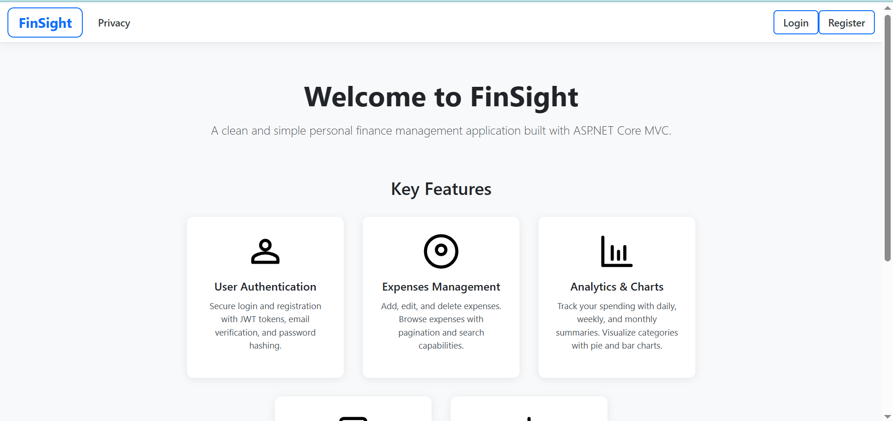
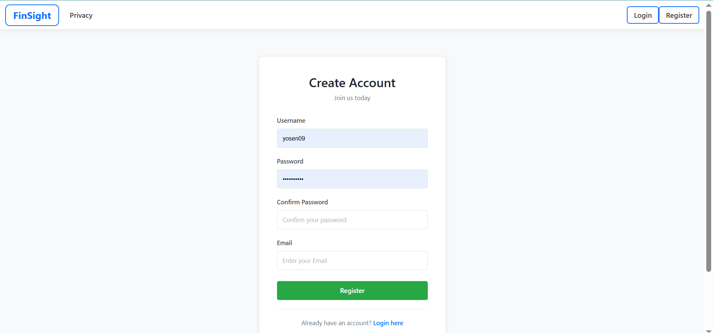
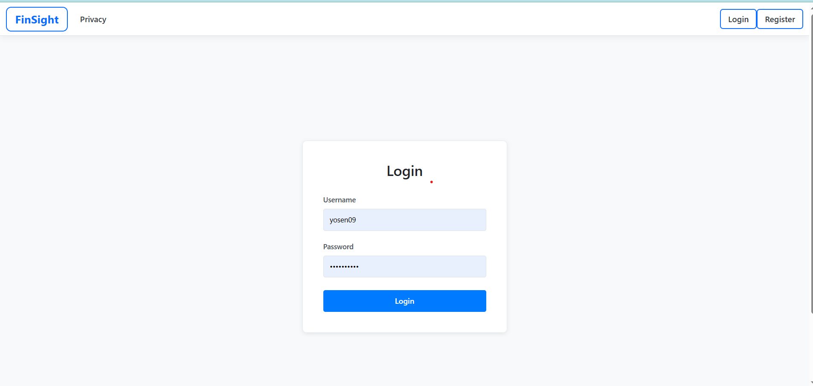
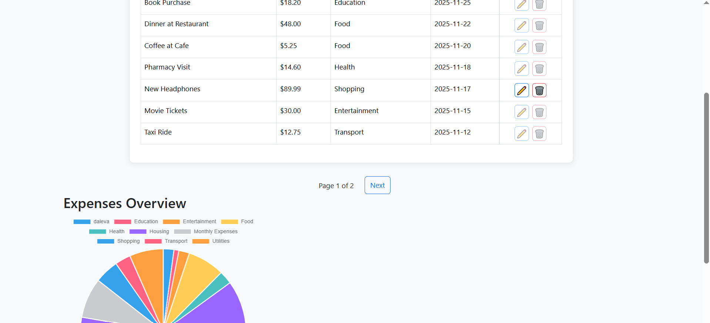
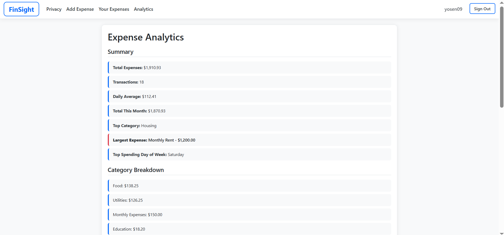

# Finance Tracker (ASP.NET MVC)

A complete finance-tracking web application FinSight built with **ASP.NET MVC**, **Entity Framework Core**, and **JWT authentication**.  
The system allows users to securely track their income, expenses, categories, and financial activity while providing visual analytics through charts and reports.

---



## Purpose of the Project
The goal of this project is to provide a **personal finance management system** that:

- Helps users understand their daily, weekly, and monthly spending.
- Organizes expenses and incomes into categories.
- Visualizes financial data using charts for better insights.
- Demonstrates clean backend development using ASP.NET MVC, EF Core, SQL, and authentication.
- Serves as a portfolio-ready backend project for learning and showcasing full-stack development structure.

---

## What This Project Can Be Used For
- Personal budgeting and tracking finances.
- Demonstrating knowledge of **backend development**.
- Showing skills in:
  - ASP.NET MVC architecture
  - Entity Framework Core
  - JWT Authentication stored in cookies
  - SQL database structure and migrations
  - Clean project structure
  - Basic analytics (pie chart, income/expense overview)




---

## Key Features
- User Registration & Login
- JWT-based authentication stored in cookies
- Email verification flow
- Add/Edit/Delete:
  - Income
  - Expenses
  - Categories
- Monthly summary dashboard
- Pie chart for category distribution
- Secure API-like structure inside MVC
- Clean separation of layers (Controllers → Services → Data)
- Custom SQL database using EF Core migrations

---


## Technologies Used
- **ASP.NET MVC**
- **Entity Framework Core**
- **SQL Server (LocalDB for development)**
- **JWT Authentication**
- **JavaScript for UI interactions**
- **Chart.js for data visualization**
- **HTML/CSS/Bootstrap**

---


## How to Run the Project Locally
Since the project is not deployed, anyone can run it on their machine.

### **Prerequisites**
- .NET SDK 8.0+
- SQL Server or LocalDB
- Visual Studio / Rider / VS Code



### **Steps**
1. Clone the repository:
   ```bash
   git clone https://github.com/meshvelianitemo/FinSight
2. Open the project in Visual Studio or VS Code.
3. Update the database connection string in appsettings.json
4. Apply migrations: dotnet ef database update
5. Run the project: dotnet run

Notes

This project currently uses local SQL Server, so deployment requires setting up a cloud database.
The app supports easy migration to cloud platforms such as Azure App Service, Railway, Supabase, or Render.

License

This project is open-source and available for learning and portfolio purposes.

